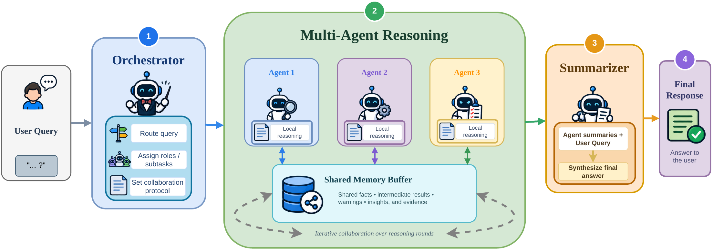

# Muffin - A Shared Memory Buffer for Asynchronous AI Agents

Muffin is an asynchronous multi-agent framework that uses shared memory to
solve complex reasoning tasks collaboratively.

[](assets/general_workflow.pdf)

## Setup

Install Python 3.11 or newer and sync the dependencies with `uv`:

```bash
uv sync
```

## Run an experiment

Pass the OpenAI-compatible API URL, benchmark, methods, and example limit
directly on the command line. The model is detected automatically from the
API's `/models` endpoint.

```bash
uv run muffin-eval \
  --openai-base-url http://localhost:8000/v1 \
  --benchmark olymmath \
  --olymmath-subset en-easy \
  --limit 100 \
  --methods single_agent,majority_vote,multiagent_debate,multiagent_dynamic_streaming
```

By default, the runner saves results under `output/` and writes per-example
JSON traces. Every default can be overridden with a CLI argument.

Run `uv run muffin-eval --help` to see all available arguments.
